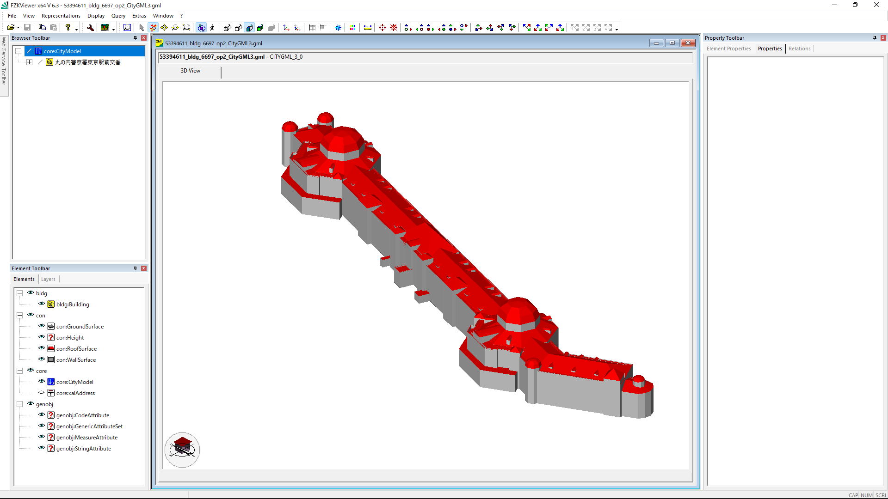
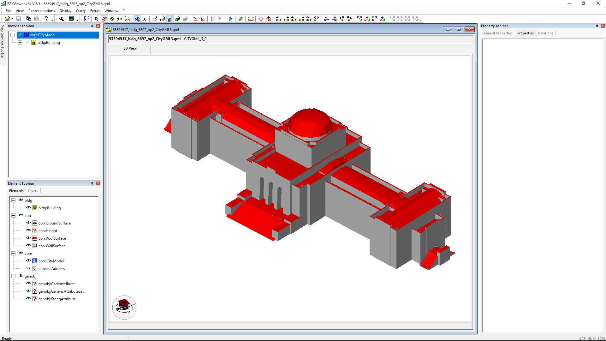

# CityGML3_ADE

ADE conversion test from CityGML 2.0 ADE to CityGML 3.0 ADE

ADE:
- Source: [urbanObject.xsd v1.5](https://www.chisou.go.jp/tiiki/toshisaisei/itoshisaisei/iur/schemas/uro/1.5/urbanObject.xsd) (Urban Object Module) from [i-Urban Revitalization](https://www.chisou.go.jp/tiiki/toshisaisei/itoshisaisei/iur/index.html) (aka i-uR, Urban Planning ADE)
- Converted ADE: [urbanObject_CityGML3.xsd](https://github.com/nob140/CityGML3_ADE/blob/main/urbanObject_CityGML3.xsd)
- Note: luse and tran were not tested and validated.

CityGML Data:
- Tokyo Station in 53394611_bldg_6697_op2.gml and Meiji Memorial Picture Gallery in 53394517_bldg_6697_op2.gml from  [Project PLATEAU](https://www.geospatial.jp/ckan/dataset/plateau-tokyo23ku) (CC BY 4.0)
- Note:
  - All data are validated by VS Code and XML Extension by Red Hat (checking syntaxs errors). However uro:buildingDetails was not validated, so please let me know if you find any problem!
  - i-UR 1.5 is same as i-UR 1.4 except for namespace URL (due to change of Japanese government server). Though original data of Project PLATEAU is using ADE i-UR 1.4, the URL of namespace "uro" were modified for using converted i-UR 1.5 ADE.
- Sample 1: [Tokyo Station](https://github.com/nob140/CityGML3_ADE/blob/main/53394611_bldg_6697_op2_CityGML3.gml) (Mesh ID: 53894611, Building ID: 13101-bldg-871)  
- Sample 2: [Meiji Memorial Picture Gallery](https://github.com/nob140/CityGML3_ADE/blob/main/53394517_bldg_6697_op2_CityGML3.gml) (Mesh ID: 53394517, Building ID: 13104-bldg-53)  
