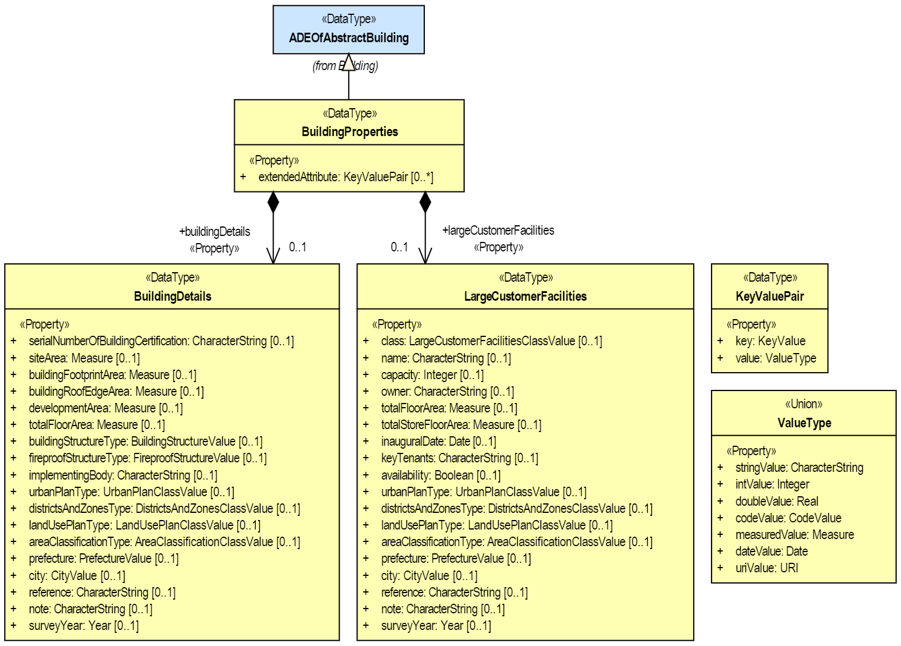
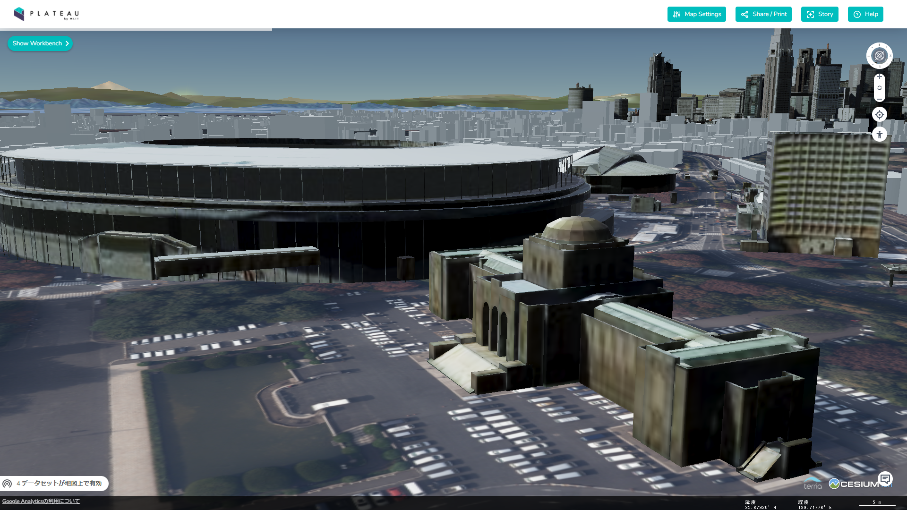

:xrefstyle: short

[[annex-examples-ADE-realworld]]
=== Annex B.xxx. Application Domain Extension (ADE) Real-world Example [Draft version]

*CityGML data model extension by UML conceptual models and XML Schemas*

The CityGML 3.0 Conceptual Model introduces the concept of https://docs.ogc.org/is/20-010/20-010.html#toc66[Application Domain Extension (ADE)] to ensure extensibility as in the previous CityGML 2.0.
The ADE mechanism allows to add new application-specific ADE feature model elements, to inject additional properties to the predefined CityGML feature type, to associate application data with predefined CityGML content, or to define value domains for attributes.
However, since the CityGML 3.0 specification separates the Conceptual Model and the Encoding, the structure and development method of ADEs differ from those in CityGML 2.0.
For example, ADE schemas should be derived fully automatically from the UML conceptual models using software tools same as other CityGML schemas.

In this Annex, examples of ADE generation and data implementation are explained using actual ADE schemas and data of CityGML 2.0, which are published as Open Standard https://www.chisou.go.jp/tiiki/toshisaisei/itoshisaisei/iur/["Data Encoding Specification of i-Urban Revitalization -Urban Planning ADE-"] and Open Data from https://www.mlit.go.jp/plateau/opendata/[the Project PLATEAU] in Japan.

*Example 1: Designing UML conceptual models*

https://www.chisou.go.jp/tiiki/toshisaisei/itoshisaisei/iur/[The Urban Planning ADE] has been published to realize "i-Urban Revitalization", an information infrastructure dedicated for urban planning to contribute to data-driven urban development and urban revitalization. In the Urban Planning ADE, four modules are defined such as Urban Object, Urban Function, Statistical Grid Module, and Public Transit. See https://portal.ogc.org/files/?artifact_id=92113[OGC Discussion Paper (OGC 20-000r1)] and https://doi.org/10.5194/isprs-annals-V-4-2020-179-2020[ISPRS annals] for more information about the Urban Planning ADE.

This example shows how to convert the Urban Object ADE (namespace: uro) of CityGML 2.0 to CityGML 3.0, and inject additional properties to predefined CityGML _Building_ feature type. To avoid complicated ADE (so-called ADE of an ADE) and allow to use multiple distinct ADEs for the same CityGML feature type, CityGML 3.0 specification recommends to inject additional properties to predefined feature type by a mechanism called "hook" rather than defining a new feature type that inherits from a predefined CityGML feature type. The rules are as follows.

. ADE schemas should be designed as UML conceptual models as described in the Requirement 48 and 49 in https://docs.ogc.org/is/20-010/20-010.html#toc71[section 9.5 in CityGML 3.0 Conceptual Model] using the software tool https://sparxsystems.com/[Enterprise Architect], and saved as .epa files.
. The hook has been implemented as _ADEOf<FeatureTypeName>_ defined for each feature type where _<FeatureTypeName>_ is the name of that feature Type. UML conceptual models should be subclass of the _ADEOf<FeatureTypeName>_ using the stereotype _«DataType»_ as described in the Requirement 50 in  https://docs.ogc.org/is/20-010/20-010.html#toc71[section 9.5 in CityGML 3.0 Conceptual Model].

The example of UML conceptual model is illustrated in <<figure-ADE-realworld-uml1>>.
Here the DataType _BuildingProperties_ is added to the CityGML _AbstractBuilding_ class by inheritance of _ADEOfAbstractBuilding_. Additionally, DataType _KeyValuePair_ and Union _ValueType_ are defined as well. By using the _BuildingProperties_ that includes two sets of properties _BuildingDetails_ and _LargeCustomerFacilities_, 3D city models can be extended systematically with the detailed properties for urban planning.

[[figure-ADE-realworld-uml1]]
.Example of UML conceptual models from Urban Planning ADE designed using Enterprise Architect.

*Example 2: Deriving ADE schemas from UML conceptual models*

According to the rules below, the ADE schemas should be derived automatically from the UML conceptual models.

. UML conceptual models (.eap files) should be converted into ADE schemas (.xsd files) by using https://shapechange.net/[ShapeChange].
. Configuration file should be prepared including the file path to the .eap files and other necessary information (e.g. codelists) for conversion using ShapeChange.

The example below shows how to convert the UML conceptual models to ADE schemas by ShapeChange.
....
java -jar ShapeChange-2.11.0.jar -Dfile.encoding=UTF-8 -c ShapeChangeConfigurationFile_CityGML_3.0_UrbanPlanningADE.xml
....

The example ShapeChange configuration file https://github.com/nob140/CityGML3_ADE/blob/main/AutomaticConversion/ShapeChange/ShapeChangeConfigurationFile_CityGML_3.0_UrbanPlanningADE.xml[ShapeChangeConfigurationFile_CityGML_3.0_UrbanPlanningADE.xml] is illustrated in <<listing-ADE-realworld-shapechange1>>.
And the derived https://github.com/nob140/CityGML3_ADE/blob/main/AutomaticConversion/urbanObject_CityGML3.xsd[ADE schema] from Enterprise Architect UML conceptual models (https://github.com/nob140/CityGML3_ADE/blob/main/AutomaticConversion/UML/CityGML_3.0_UrbanPlanningADE.eap[CityGML_3.0_UrbanPlanningADE.eap]) is illustrated in <<listing-ADE-realworld-ADE1>>.

[[listing-ADE-realworld-shapechange1]]
.Example of ShapeChange configuration file for converting from Enterprise Architect UML conceptual models to ADE schemas.
[source,XML]
----
<?xml version="1.0" encoding="UTF-8"?>
<ShapeChangeConfiguration xmlns:xi="http://www.w3.org/2001/XInclude" 
    xmlns="http://www.interactive-instruments.de/ShapeChange/Configuration/1.1" 
    xmlns:sc="http://www.interactive-instruments.de/ShapeChange/Configuration/1.1"  
    xmlns:xsi="http://www.w3.org/2001/XMLSchema-instance" 
    xsi:schemaLocation="http://www.interactive-instruments.de/ShapeChange/Configuration/1.1 http://shapechange.net/resources/schema/ShapeChangeConfiguration.xsd">
    
  <input>
    <parameter name="inputModelType" value="EA7"/>
    <parameter name="inputFile" value="D:/CityGML/ADEs/Urban_Planning_ADE/UML/CityGML_3.0_UrbanPlanningADE.eap"/>
    <parameter name="appSchemaName" value="UrbanObjectData"/>
    <parameter name="checkingConstraints" value="disabled"/>
    <parameter name="addTaggedValues" value="itemType"/>
    <xi:include href="http://shapechange.net/resources/config/StandardAliases.xml"/>
    <stereotypeAliases>
      <StereotypeAlias wellknown="property" alias="Property"/>
      <StereotypeAlias wellknown="version" alias="Version"/>
      <StereotypeAlias wellknown="FeatureType" alias="TopLevelFeatureType"/>
    </stereotypeAliases>
  </input>
  
  <log>
    <parameter name="reportLevel" value="INFO"/>
    <parameter name="logFile" value="D:/CityGML/ADEs/Urban_Planning_ADE/logs/Log_CityGML_3.0_UrbanPlanningADE.xml"/>
  </log>
  
  <targets>
    <TargetXmlSchema class="de.interactive_instruments.ShapeChange.Target.XmlSchema.XmlSchema" mode="enabled">
      <targetParameter name="outputDirectory" value="D:/CityGML/ADEs/Urban_Planning_ADE/xsds"/>
      <targetParameter name="defaultEncodingRule" value="citygml"/>
      <rules>
        <EncodingRule name="citygml" extends="iso19136_2007">
          <rule name="rule-xsd-rel-association-classes"/>
          <rule name="rule-xsd-cls-basictype"/>
          <rule name="rule-xsd-prop-initialValue"/>
          <rule name="rule-xsd-prop-att-map-entry"/>
          <rule name="rule-xsd-prop-constrainingFacets"/>
          <rule name="rule-xsd-all-notEncoded"/>
          <rule name="rule-xsd-cls-union-asGroup"/>
        </EncodingRule>
      </rules>
      <xi:include href="http://shapechange.net/resources/config/StandardRules.xml"/>
      <xi:include href="http://shapechange.net/resources/config/StandardNamespaces.xml"/>
      <xmlNamespaces>
       <XmlNamespace nsabr="app" ns="http://www.opengis.net/citygml/appearance/3.0" location="../schema/appearance.xsd"/>
       <XmlNamespace nsabr="brid" ns="http://www.opengis.net/citygml/bridge/3.0" location="../schema/bridge.xsd"/>
       <XmlNamespace nsabr="bldg" ns="http://www.opengis.net/citygml/building/3.0" location="../schema/building.xsd"/>
       <XmlNamespace nsabr="pcl" ns="http://www.opengis.net/citygml/pointcloud/3.0" location="../schema/pointCloud.xsd"/>
       <XmlNamespace nsabr="frn" ns="http://www.opengis.net/citygml/cityfurniture/3.0" location="../schema/cityFurniture.xsd"/>
       <XmlNamespace nsabr="grp" ns="http://www.opengis.net/citygml/cityobjectgroup/3.0" location="../schema/cityObjectGroup.xsd"/>
       <XmlNamespace nsabr="con" ns="http://www.opengis.net/citygml/construction/3.0" location="../schema/construction.xsd"/>
       <XmlNamespace nsabr="core" ns="http://www.opengis.net/citygml/3.0" location="../schema/core.xsd"/>
       <XmlNamespace nsabr="dyn" ns="http://www.opengis.net/citygml/dynamizer/3.0" location="../schema/dynamizer.xsd"/>
       <XmlNamespace nsabr="gen" ns="http://www.opengis.net/citygml/generics/3.0" location="../schema/generics.xsd"/>
       <XmlNamespace nsabr="luse" ns="http://www.opengis.net/citygml/landuse/3.0" location="../schema/landUse.xsd"/>
       <XmlNamespace nsabr="dem" ns="http://www.opengis.net/citygml/relief/3.0" location="../schema/relief.xsd"/>
       <XmlNamespace nsabr="tran" ns="http://www.opengis.net/citygml/transportation/3.0" location="../schema/transportation.xsd"/>
       <XmlNamespace nsabr="tun" ns="http://www.opengis.net/citygml/tunnel/3.0" location="../schema/tunnel.xsd"/>
       <XmlNamespace nsabr="veg" ns="http://www.opengis.net/citygml/vegetation/3.0" location="../schema/vegetation.xsd"/>
       <XmlNamespace nsabr="vers" ns="http://www.opengis.net/citygml/versioning/3.0" location="../schema/versioning.xsd"/>
       <XmlNamespace nsabr="wtr" ns="http://www.opengis.net/citygml/waterbody/3.0" location="../schema/waterBody.xsd"/>
       <XmlNamespace nsabr="xAL" ns="urn:oasis:names:tc:ciq:xal:3" location="http://docs.oasis-open.org/ciq/v3.0/cs02/xsd/default/xsd/xAL.xsd"/> 
      </xmlNamespaces>
      <xi:include href="http://shapechange.net/resources/config/StandardMapEntries.xml"/>
      <xsdMapEntries>
        <XsdMapEntry type="URI" xsdEncodingRules="iso19136_2007 gml33" xmlPropertyType="anyURI" xmlType="anyURI" xmlTypeType="simple" xmlTypeContent="simple"/>
      </xsdMapEntries>
    </TargetXmlSchema>
    <Target class="de.interactive_instruments.ShapeChange.Target.Codelists.CodelistDictionaries" mode="disabled">
      <targetParameter name="outputDirectory" value="D:/CityGML/ADEs/Urban_Planning_ADE/codelists"/>
    </Target>
  </targets>
</ShapeChangeConfiguration>
----

[[listing-ADE-realworld-ADE1]]
.Example of ADE schema document derived from UML conceptual models.
[source,XML]
----
<?xml version="1.0" encoding="UTF-8"?><schema xmlns="http://www.w3.org/2001/XMLSchema" xmlns:bldg="http://www.opengis.net/citygml/building/3.0" ...  xmlns:uro="https://www.chisou.go.jp/tiiki/toshisaisei/itoshisaisei/iur/uro/1.5" elementFormDefault="qualified" targetNamespace="https://www.chisou.go.jp/tiiki/toshisaisei/itoshisaisei/iur/uro/1.5" version="1.5.1">
  <import namespace="http://www.opengis.net/citygml/building/3.0" schemaLocation="../schema/building.xsd"/>
  ...
  <!--XML Schema document created by ShapeChange - http://shapechange.net/-->
  <element name="BuildingDetails" substitutionGroup="gml:AbstractObject" type="uro:BuildingDetailsType"/>
  <complexType name="BuildingDetailsType">
    <sequence>
      <element minOccurs="0" name="serialNumberOfBuildingCertification" type="string"/>
      <element minOccurs="0" name="siteArea" type="gml:MeasureType"/>
      <element minOccurs="0" name="buildingFootprintArea" type="gml:MeasureType"/>
      <element minOccurs="0" name="buildingRoofEdgeArea" type="gml:MeasureType"/>
      <element minOccurs="0" name="developmentArea" type="gml:MeasureType"/>
      <element minOccurs="0" name="totalFloorArea" type="gml:MeasureType"/>
      <element minOccurs="0" name="buildingStructureType" type="gml:CodeType"/>
      <element minOccurs="0" name="fireproofStructureType" type="gml:CodeType"/>
      <element minOccurs="0" name="implementingBody" type="string"/>
      <element minOccurs="0" name="urbanPlanType" type="gml:CodeType"/>
      <element minOccurs="0" name="districtsAndZonesType" type="gml:CodeType"/>
      <element minOccurs="0" name="landUsePlanType" type="gml:CodeType"/>
      <element minOccurs="0" name="areaClassificationType" type="gml:CodeType"/>
      <element minOccurs="0" name="prefecture" type="gml:CodeType"/>
      <element minOccurs="0" name="city" type="gml:CodeType"/>
      <element minOccurs="0" name="reference" type="string"/>
      <element minOccurs="0" name="note" type="string"/>
      <element minOccurs="0" name="surveyYear" type="gYear"/>
    </sequence>
  </complexType>
  <complexType name="BuildingDetailsPropertyType">
    <sequence>
      <element ref="uro:BuildingDetails"/>
    </sequence>
  </complexType>
  <element name="BuildingProperties" substitutionGroup="bldg:ADEOfAbstractBuilding" type="uro:BuildingPropertiesType"/>
  <complexType name="BuildingPropertiesType">
    <complexContent>
      <extension base="bldg:ADEOfAbstractBuildingType">
        <sequence>
          <element minOccurs="0" name="buildingDetails" type="uro:BuildingDetailsPropertyType"/>
          <element minOccurs="0" name="largeCustomerFacilities" type="uro:LargeCustomerFacilitiesPropertyType"/>
          <element maxOccurs="unbounded" minOccurs="0" name="extendedAttribute" type="uro:KeyValuePairPropertyType"/>
        </sequence>
      </extension>
    </complexContent>
  </complexType>
  <complexType name="BuildingPropertiesPropertyType">
    <sequence>
      <element ref="uro:BuildingProperties"/>
    </sequence>
  </complexType>
  <element name="CityObjectGroupProperties" substitutionGroup="grp:ADEOfCityObjectGroup" type="uro:CityObjectGroupPropertiesType"/>
  <complexType name="CityObjectGroupPropertiesType">
    <complexContent>
      <extension base="grp:ADEOfCityObjectGroupType">
        <sequence>
          <element minOccurs="0" name="fiscalYearOfPublication" type="gYear"/>
          <element minOccurs="0" name="language" type="gml:CodeType"/>
        </sequence>
      </extension>
    </complexContent>
  </complexType>
  <complexType name="CityObjectGroupPropertiesPropertyType">
    <sequence>
      <element ref="uro:CityObjectGroupProperties"/>
    </sequence>
  </complexType>
  <element name="KeyValuePair" substitutionGroup="gml:AbstractObject" type="uro:KeyValuePairType"/>
  <complexType name="KeyValuePairType">
    <sequence>
      <element name="key" type="gml:CodeType"/>
      <group ref="uro:ValueTypeGroup"/>
    </sequence>
  </complexType>
  <complexType name="KeyValuePairPropertyType">
    <sequence>
      <element ref="uro:KeyValuePair"/>
    </sequence>
  </complexType>
  <element name="LandUseProperties" substitutionGroup="luse:ADEOfLandUse" type="uro:LandUsePropertiesType"/>
  <complexType name="LandUsePropertiesType">
    <complexContent>
      <extension base="luse:ADEOfLandUseType">
        <sequence>
          <element minOccurs="0" name="nominalArea" type="gml:MeasureType"/>
          <element minOccurs="0" name="ownerType" type="gml:CodeType"/>
          <element minOccurs="0" name="owner" type="string"/>
          <element minOccurs="0" name="areaInSquareMeter" type="gml:MeasureType"/>
          <element minOccurs="0" name="areaInHa" type="gml:MeasureType"/>
          <element minOccurs="0" name="urbanPlanType" type="gml:CodeType"/>
          <element minOccurs="0" name="districtsAndZonesType" type="gml:CodeType"/>
          <element minOccurs="0" name="landUsePlanType" type="gml:CodeType"/>
          <element minOccurs="0" name="areaClassificationType" type="gml:CodeType"/>
          <element minOccurs="0" name="prefecture" type="gml:CodeType"/>
          <element minOccurs="0" name="city" type="gml:CodeType"/>
          <element minOccurs="0" name="reference" type="string"/>
          <element minOccurs="0" name="note" type="string"/>
          <element minOccurs="0" name="surveyYear" type="gYear"/>
        </sequence>
      </extension>
    </complexContent>
  </complexType>
  <complexType name="LandUsePropertiesPropertyType">
    <sequence>
      <element ref="uro:LandUseProperties"/>
    </sequence>
  </complexType>
  <element name="LargeCustomerFacilities" substitutionGroup="gml:AbstractObject" type="uro:LargeCustomerFacilitiesType"/>
  <complexType name="LargeCustomerFacilitiesType">
    <sequence>
      <element minOccurs="0" name="class" type="gml:CodeType"/>
      <element minOccurs="0" name="name" type="string"/>
      <element minOccurs="0" name="capacity" type="integer"/>
      <element minOccurs="0" name="owner" type="string"/>
      <element minOccurs="0" name="totalFloorArea" type="gml:MeasureType"/>
      <element minOccurs="0" name="totalStoreFloorArea" type="gml:MeasureType"/>
      <element minOccurs="0" name="inauguralDate" type="date"/>
      <element minOccurs="0" name="keyTenants" type="string"/>
      <element minOccurs="0" name="availability" type="boolean"/>
      <element minOccurs="0" name="urbanPlanType" type="gml:CodeType"/>
      <element minOccurs="0" name="districtsAndZonesType" type="gml:CodeType"/>
      <element minOccurs="0" name="landUsePlanType" type="gml:CodeType"/>
      <element minOccurs="0" name="areaClassificationType" type="gml:CodeType"/>
      <element minOccurs="0" name="prefecture" type="gml:CodeType"/>
      <element minOccurs="0" name="city" type="gml:CodeType"/>
      <element minOccurs="0" name="reference" type="string"/>
      <element minOccurs="0" name="note" type="string"/>
      <element minOccurs="0" name="surveyYear" type="gYear"/>
    </sequence>
  </complexType>
  <complexType name="LargeCustomerFacilitiesPropertyType">
    <sequence>
      <element ref="uro:LargeCustomerFacilities"/>
    </sequence>
  </complexType>
  <element name="RoadProperties" substitutionGroup="tran:ADEOfRoad" type="uro:RoadPropertiesType"/>
  <complexType name="RoadPropertiesType">
    <complexContent>
      <extension base="tran:ADEOfRoadType">
        <sequence>
          <element minOccurs="0" name="width" type="gml:LengthType"/>
          <element minOccurs="0" name="widthType" type="gml:CodeType"/>
          <element minOccurs="0" name="trafficVolume" type="uro:TrafficVolumePropertyType"/>
        </sequence>
      </extension>
    </complexContent>
  </complexType>
  <complexType name="RoadPropertiesPropertyType">
    <sequence>
      <element ref="uro:RoadProperties"/>
    </sequence>
  </complexType>
  <element name="TrafficVolume" substitutionGroup="gml:AbstractObject" type="uro:TrafficVolumeType"/>
  <complexType name="TrafficVolumeType">
    <sequence>
      <element minOccurs="0" name="weekday12hourTrafficVolume" type="integer"/>
      <element minOccurs="0" name="weekday24hourTrafficVolume" type="integer"/>
      <element minOccurs="0" name="largeVehicleRate" type="double"/>
      <element minOccurs="0" name="congestionRate" type="double"/>
      <element minOccurs="0" name="averageTravelSpeedInCongestion" type="double"/>
      <element minOccurs="0" name="observationPointName" type="string"/>
      <element minOccurs="0" name="urbanPlanType" type="gml:CodeType"/>
      <element minOccurs="0" name="areaClassificationType" type="gml:CodeType"/>
      <element minOccurs="0" name="prefecture" type="gml:CodeType"/>
      <element minOccurs="0" name="city" type="gml:CodeType"/>
      <element minOccurs="0" name="reference" type="string"/>
      <element minOccurs="0" name="note" type="string"/>
      <element minOccurs="0" name="surveyYear" type="gYear"/>
    </sequence>
  </complexType>
  <complexType name="TrafficVolumePropertyType">
    <sequence>
      <element ref="uro:TrafficVolume"/>
    </sequence>
  </complexType>
  <group name="ValueTypeGroup">
    <choice>
      <element name="stringValue" type="string"/>
      <element name="intValue" type="integer"/>
      <element name="doubleValue" type="double"/>
      <element name="codeValue" type="gml:CodeType"/>
      <element name="measuredValue" type="gml:MeasureType"/>
      <element name="dateValue" type="date"/>
      <element name="uriValue" type="anyURI"/>
    </choice>
  </group>
</schema>
----

*Example 3: CityGML 3.0 building models adopting converted ADE schemas*

https://www.mlit.go.jp/plateau/[The Project PLATEAU] has launched by MLIT (Ministry of Land, Infrastructure, Transport and Tourism) Japan, and developed 3D city models more than 10 million buildings of 56 cities, over 10,000km2 in Japan in 2020. The 3D city models has implemented using Urban Planning ADE and published as Open Data (CC BY 4.0/ODbL).

The <<figure-ADE-realworld-step2>> illustrates sample building data, and the <<listing-ADE-realworld-gml1>> shows example of https://github.com/nob140/CityGML3_ADE/blob/main/AutomaticConversion/53394517_bldg_6697_op2_CityGML3.gml[the converted GML instance document] from CityGML 2.0 building models to CityGML 3.0. Note that this conversion has operated manually by checking the ADE schema carefully. Though there are converters of CityGML 2.0 and CityGML 3.0 such as https://github.com/tum-gis/citygml2-to-citygml3[citygml2-to-citygml3], data conversion using ADE is a challenge in the future.

[[figure-ADE-realworld-step2]]
.Meiji Memorial Picture Gallery (Mesh ID: 53394517, Building ID: 13104-bldg-53) from https://www.geospatial.jp/ckan/dataset/plateau-tokyo23ku-citygml-2020[the Project PLATEAU].

[[listing-ADE-realworld-gml1]]
.Example of CityGML 3.0 GML instance document using converted ADE schema.
[source,XML]
----
<?xml version="1.0" encoding="UTF-8"?>
<core:CityModel xmlns:uro="https://www.chisou.go.jp/tiiki/toshisaisei/itoshisaisei/iur/uro/1.5" ...
xsi:schemaLocation="https://www.chisou.go.jp/tiiki/toshisaisei/itoshisaisei/iur/uro/1.5 ./urbanObject_CityGML3.xsd ...">
  <gml:boundedBy> ... </gml:boundedBy>
  <core:cityObjectMember>
    <bldg:Building gml:id="BLD_77ca1a15-3b35-4386-8f86-152ed71c4c64">
      <core:genericAttribute> ... </core:genericAttribute>
      ...
      <core:boundary> ... </core:boundary>
      ...
      <core:lod0MultiSurface> ... </core:lod0MultiSurface>
      <core:lod1Solid> ... </core:lod1Solid>
      <core:lod2Solid> ... </core:lod2Solid>
      <con:height> ... </con:height>
      <bldg:address> ... </bldg:address>
      <bldg:adeOfAbstractBuilding>
        <uro:BuildingProperties>
          <uro:buildingDetails>
            <uro:BuildingDetails>
              <uro:buildingRoofEdgeArea uom="m2">2513.85520</uro:buildingRoofEdgeArea>
              <uro:districtsAndZonesType codeSpace="../codelists/Common_districtsAndZonesType.xml">4</uro:districtsAndZonesType>
              <uro:prefecture codeSpace="../codelists/Common_prefecture.xml">13</uro:prefecture>
              <uro:city codeSpace="../codelists/Common_localPublicAuthorities.xml">13104</uro:city>
              <uro:surveyYear>2016</uro:surveyYear>
            </uro:BuildingDetails>
          </uro:buildingDetails>
          <uro:extendedAttribute>
            <uro:KeyValuePair>
              <uro:key codeSpace="../codelists/extendedAttribute_key.xml">2</uro:key>
              <uro:codeValue codeSpace="../codelists/extendedAttribute_key2.xml">2</uro:codeValue>
            </uro:KeyValuePair>
          </uro:extendedAttribute>
          <uro:extendedAttribute>
            <uro:KeyValuePair>
              <uro:key codeSpace="../codelists/extendedAttribute_key.xml">105</uro:key>
              <uro:codeValue codeSpace="../codelists/extendedAttribute_key105.xml">2</uro:codeValue>
            </uro:KeyValuePair>
          </uro:extendedAttribute>
          <uro:extendedAttribute>
            <uro:KeyValuePair>
              <uro:key codeSpace="../codelists/extendedAttribute_key.xml">106</uro:key>
              <uro:codeValue codeSpace="../codelists/extendedAttribute_key106.xml">20</uro:codeValue>
            </uro:KeyValuePair>
          </uro:extendedAttribute>
        </uro:BuildingProperties>
      </bldg:adeOfAbstractBuilding>
    </bldg:Building>
  </core:cityObjectMember>
  <core:appearanceMember> ... </core:appearanceMember>
</core:CityModel>
----

